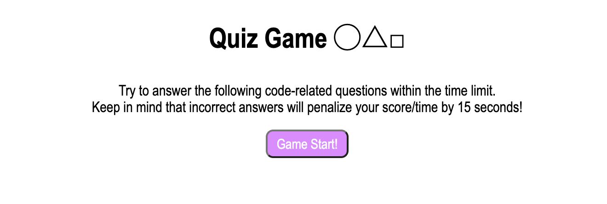

# Timed Code Quiz (Quiz Game)

A simple Javascript quiz that runs in the browser and features dynamically updated HTML and CSS. It features a clean and polished user interface, ensuring that it adapts to multiple screen sizes. For each question wrong, the timer will be deducted by 15 seconds. At the end of the quiz, the user may sumbit their initials and score to the Highscore board.

## Main URLs

Github Repo:  https://github.com/Veoprato/timed-code-quiz/

Github Webpage:  https://veoprato.github.io/timed-code-quiz/